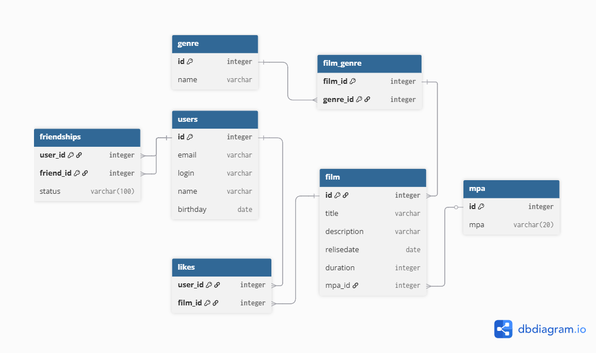

# java-filmorate
Template repository for Filmorate project.



## Создание таблиц

```SQL
CREATE TABLE IF NOT EXISTS mpa (
    id BIGINT GENERATED ALWAYS AS IDENTITY PRIMARY KEY,
    mpa VARCHAR(20) NOT NULL
);


CREATE TABLE IF NOT EXISTS films (
    id BIGINT GENERATED ALWAYS AS IDENTITY PRIMARY KEY,
    name VARCHAR(255) NOT NULL,
    description VARCHAR(200),
    release_date DATE,
    duration INTEGER,
    mpa_id INTEGER REFERENCES mpa(id)
);

CREATE TABLE IF NOT EXISTS genre (
    id BIGINT GENERATED ALWAYS AS IDENTITY PRIMARY KEY,
    name VARCHAR(255) NOT NULL
);

CREATE TABLE IF NOT EXISTS film_genre (
    film_id INTEGER NOT NULL REFERENCES films(id),
    genre_id INTEGER NOT NULL REFERENCES genre(id),
    PRIMARY KEY (film_id, genre_id)
);

CREATE TABLE IF NOT EXISTS users (
    id BIGINT GENERATED ALWAYS AS IDENTITY PRIMARY KEY,
    email VARCHAR(255) NOT NULL UNIQUE,
    login VARCHAR(255) NOT NULL UNIQUE,
    name VARCHAR(255) NOT NULL,
    birthday DATE
);

CREATE TABLE IF NOT EXISTS friendships (
    user_id INTEGER NOT NULL REFERENCES users(id),
    friend_id INTEGER NOT NULL REFERENCES users(id),
    status VARCHAR(255),
    PRIMARY KEY (user_id, friend_id)
);

CREATE TABLE IF NOT EXISTS likes (
    user_id INTEGER NOT NULL REFERENCES users(id),
    film_id INTEGER NOT NULL REFERENCES films(id),
    PRIMARY KEY(user_id, film_id)
);
```

## Примеры основых запросов

_Колличество лайков у фильмов_
```SQL
select COUNT(l.user_id ) as likes, f.title
from film as f
join likes l on f.film_id = l.film_id
group by f.title;
```
_Получить 10 самых популярных фильмов_
```SQL
SELECT f.title, COUNT(l.user_id) AS likes
FROM film f
JOIN likes l ON f.film_id = l.film_id
GROUP BY f.title
ORDER BY likes DESC
LIMIT 10;
```
_Жанр самого популярного фильма_
```SQL
SELECT g.*
FROM ( SELECT fg.genre_id, COUNT(l.user_id) AS likes 
	FROM film AS f 
	JOIN likes l ON f.film_id = l.film_id 
	JOIN film_genre fg ON f.film_id = fg.film_id 
	GROUP BY fg.genre_id ORDER BY likes DESC LIMIT 1 ) AS count_like 
JOIN genre g ON count_like.genre_id = g.genre_id;
```
_Получить список Фильмов определенного жанра_
```SQL
select f.title
from film f 
join film_genre fg on f.film_id = fg.film_id
join genre g on fg.genre_id = g.genre_id 
where g."name" = 'Документальный'
```
_Пользователи подтвердившие дружбу с пользователем(id = 2)_
```SQL
select u.name , f.status
from friendships f 
join users u on f.friend_id = u.user_id
where f.user_id = 2 and f.status = 'CONFIRMED'
```